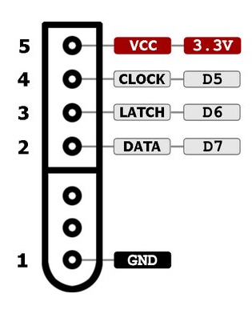

# SNESBridge

Reads an SNES controller from an Arduino and streams the pressed buttons
over USB serial at 9600 baud.

## Pinout



## How button detection works

The SNES controller contains two cascaded CD4021 parallel-in/serial-out shift
registers that together sample 16 digital inputs. Twelve are wired to the
button contacts; the remaining four are unused. Every line is active-LOW: a
pressed button pulls that input to ground, an unpressed button reads HIGH.

The Arduino drives a strict three-wire protocol to read those 16 bits:

1. **Latch** — the Arduino pulses `LATCH` HIGH for ~12 µs. On the rising
   edge, the shift registers snapshot the state of all 16 inputs in parallel.
2. **Clock + Read** — for each of 16 iterations, the Arduino drives `CLOCK`
   LOW, reads `DATA`, then drives `CLOCK` HIGH. Each falling edge of `CLOCK`
   shifts the next bit onto `DATA`. The first bit is already presented on
   `DATA` right after the latch, so we read *before* clocking.

The whole read takes roughly 200 µs and `loop()` repeats it every 50 ms
(~20 Hz polling), which is plenty for a 60 Hz game input.

### Disconnected State

When no controller is plugged in, the `DATA` line is not driven by anything
and reads LOW for all 16 clocks on this wiring, (`0x0000`). A real controller cannot produce that value — it would require all
12 buttons *and* the 4 grounded signature lines to be active simultaneously.
The code treats `0x0000` as "disconnected" and prints a one-shot
transition message when the state changes.

## Build and upload

This project uses [PlatformIO](https://platformio.org/). Install the
PlatformIO Core CLI (or the VS Code extension) first.

From the project root:

```bash
# Build
pio run

# Upload to the Arduino (auto-detects the serial port)
pio run --target upload

# Open the serial monitor at 9600 baud to see button output
pio device monitor -b 9600
```

To target a specific port, pass `--upload-port /dev/ttyACM0` (or the
equivalent on your system) to the upload command.
